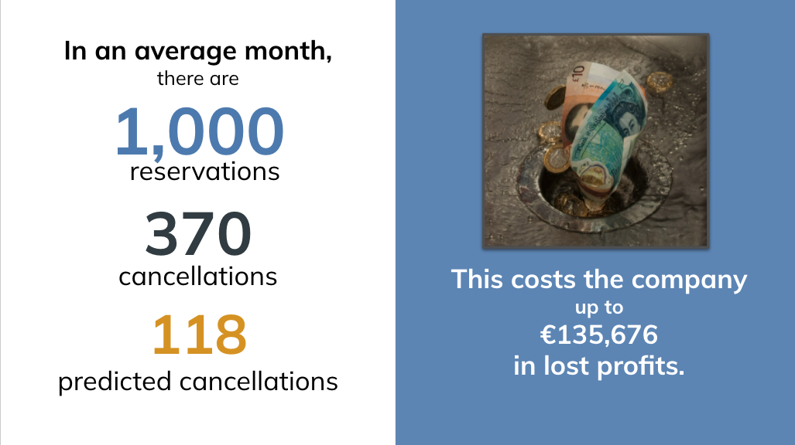

# Predicting Cancellations to Improve Hotel Profits


## Understanding the Problem

Azulejos Ltd. is a boutique hotel management company that has two properties in Portugal. These two properties had 119,390 reservations made between July 1, 2015 and August 13, 2017. Of these reservations, 44,224 (37%) canceled before their scheduled arrival date.


## Business Value

### How Cancellations Impact Profit

On average, customers reserve a room 104 days before their anticipated arrival date. Once it is reserved, it is unavailable to other customers. As a result, cancellations can result in reduced profits if the room is unable to be re-booked before the scheduled dates. With an average daily rate of €101.83 and an average stay length of 3.4 days, ***a canceled room that remains vacant costs the hotel an average of €346.22 per cancellation.***


### Current Hotel Predictions



Currently, only 12.2% of the customers are charged a non-refundable deposit, which helps to mitigate the profit loss caused by cancellations. The hotel management company's current strategy for predicting cancellations is inferred through its deposit strategy. 99% of customers who are charged a deposit go on to cancel. This indicates that the current strategy has a high precision rate - if a customer is predicted to cancel, they almost certainly will. However, the **current strategy only identifies 32% of the customers that go on to cancel**, which means the majority of cancellations are not associated with a deposit that can help buffer the potential loss in profits. 

By identifying ahead of time which customers are more likely to cancel and understanding the patterns that occur in cancellations, the Azulejos Ltd. will be able to implement strategies to reduce the lost profits that result from cancellations.

## Methodology

The data from 119,390 reservations made between July 1, 2015 and August 13, 2017 will be used to create a model that can use information about a customer and their reservation to predict if they are likely to cancel. In addition, the data will be analyzed for trends and patterns that will help to understand when and why cancellations occur.


## Understanding the Data

### Imbalanced Classes

This is an imbalanced data set, with the majority of reservations not resulting in a cancellation. This class imbalance will need to be addressed during the data preparation stage before training a model. 


### Feature Engineering

***Each feature was analyzed*** for the distribution or the counts of the categories. In many cases, there were a few categories with the majority of the observations and many categories with only a few observations. Generally, these were reorganized into fewer categories, so that the model would be less prone to overfit on the small amounts of data in underrepresented categories. 

***Missing values were found in three columns: country, agent and company.*** In the first two, the missing values were replaced with a category of "none." In the last, the column had more missing values that actual data and contained much of the same information as another column, so it was dropped from the dataset entirely.  
 
Altogether, ***a total of 1,131 observations (0.95% of the data)were removed*** because they were either outliers (these appeared to be clerical errors), they represented anomalies in how the data were recorded or the observations were not relevant.  

For example, there are 680 observations that indicate that a customer checked in and checked out, but had a total stay of 0 nights. This is confirmed by examining the records and noting that in these cases, the reservation date matches the reservation status date, which for customers who did not cancel, is the day they checked out. In looking at the average daily rate for these customers, it is clear that they did not pay for the room, even if they did not technically cancel. Often further examination, none of these customers reserved the room ahead of time. This means that although they did not contribute to any profit for the hotel, they also did not prevent the hotel from earning profit because the room was not held in reserve for them. It is unclear why some of these are coded as cancellations and others are recorded as checked-out. Because this data is ambiguous and the last-minute reservations did not hinder profitability, these records will be dropped from the data.


### Feature Selection

The columns with name, phone, email and credit card have synthetic data for anonymity and so can be removed.

The columns of reservation status and reservation status date will need to be removed for modeling since  'is_canceled' is being used as the target and those two columns contain information that relates to the target.

The following will also be removed: arrival date (too granular, and keeping arrival week number to account for seasonal changes), meal (not enough variation or relevant information), required_car_parking_spaces (not enough variation or relevant information)


## Modeling


### Goals for Modeling

The goal is to create a model that can be used by the hotels to predict which customers are likely to cancel their reservations. 

If this information is used to implement policy changes that may negatively impact customers that are falsely identified as potentially canceling (i.e. requiring a deposit or overbooking rooms), it is important to have high precision. However, if the goal is to identify as many potential cancellations as possible and the policy changes don't negatively impact customers falsely identified as cancellations (i.e. sending a reminder email or offering last-minute specials during times when cancellations are more likely to occur), it is important to have high recall.

Since this situation has arguments for both high precision and recall and there are no catastrophic consequences foreseen for either false positives or false negatives, it makes the most sense to ***select a model that balances precision and recall and has a high overall accuracy***. Therefore, since the F1 score is a measure of both precision and recall, ***F1 will be optimized*** for when evaluating the models. 


### Data Preparation

The data was split into a training set (70%), a validation set (15%) and a test set(15%). Next, the training data was preprocessed by one hot encoding the categorical variables and scaling the numerical features (required for some of the models). Then, SMOTE was applied to both the feature and target training sets to balance the classes. 

In order to prevent data leakage, the preprocessing pipeline was only used to transform (not fit) the validation and test data. SMOTE was not applied to either of these data sets in order to obtain an accurate measure of how the model works on the actual, unbalanced data.


### Summary of Iterative Process

Nine different models were tested at this point, each using the default hyperparameters: a baseline model (using SKLearn's DummyClassifier), logistic regression, K-nearest neighbors, a support vector classifier, a decision tree, random forest, gradient boost, ADA boost and XGBoost (the last four are ensemble methods). 

Each model was evaluated using 5-fold cross-validation and then the predictions on the validation set were used to generate classification reports, confusion matrices and ROC-AUC curves. These metrics were then used to select the most promising models to evaluate further. 

The important information is highlighted below.   


***All of the models significantly improved upon the baseline accuracy.*** The extreme differences in the accuracy scores between the training folds and the testing folds in the  tree, knn, xbg and forest models indicates overfitting.


As mentioned before, it is desirable to have a balance between precision and recall for this application. The baseline model had an F1 score of 37 and all of the models more than double this, with knn, xgb and random forest showing the most improvement.


***Because of the class imbalance, all of the models perform better on the majority class (not-canceled) than the minority class (canceled).*** Because the goal is to predict the minority class, it makes sense to focus on the models that do better with those predictions. The models varied the most in terms of precision with the minority class. In other words, they have a tendency to predict that customers won't cancel when, in fact they do. 


K-nearest neighbors, which performed well in other areas, did not do well here.

***The following models had high accuracy scores, high F1 scores, a smaller difference in F1 between the classes and higher precision scores for the minority class and will be evaluated further:***

- Support Vector Classifier
- Random Forest
- XG Boost


### Evaluating Features and Model Tuning

The random forest model and, to a lesser extent, XGBoost, are showing signs of overfitting. Before tuning the models, the preliminary feature importances were examined and 4 non-important (accounting for less than 1% of the classification decision) features were removed. 

Before the feature reduction, the random forest model had the following averages from cross-validation:

- Accuracy: Train 0.99, Test 0.88
- F1: Train 0.99, Test 0.88

After the feature reduction, the ***overfitting was greatly improved***, as evidenced by the smaller differences between the train and test metrics.

- Accuracy: Train 0.89, Test 0.87
- F1: Train 0.89, Test 0.87

The validation scores dropped very slightly with the feature reduction, but not enough to be of concern. 

Similar outcomes were seen with XGBoost and SVC did very slightly worse with the reduced features.

A grid search was used to tune both the random forest and XGBoost models, with the primary goals of further reducing overfitting and increasing the performance on the minority class. 

**Original Random Forest Classification Report**


**Random Forest Classification Report After Feature Reduction and Tuning**


Recall and precision both increased slightly for the minority class and are balanced and overfitting increased slightly. 

SVC did not improve with tuning (which was minimal due to run time) and since the interpretability of the results is important, it will not be evaluated further. 

There is still some overfitting (although greatly reduced with feature removal and pruning), with the biggest impact seen in recall and overall accuracy. However, even with the overfitting, the model is still consistent with the validation data.

Because of the imbalanced classes, both models do better at predicting the majority class (not canceled) than the minority one (canceled).

***Random Forest***

- Overall accuracy is 86%; the model's predictions are correct 86.1% of the time.
- Of those that actually canceled, 81.5% of them were correctly predicted to cancel (recall).
- Of those that were predicted to cancel, 81.8% of them actually did (precision).
- The false negative rate is 18.5%, which means that 18.5% of the actual cancellations were incorrectly predicted to keep their reservation.
- The false positive rate is 10.6%, which means that 10.6% of the customers who did not cancel were incorrectly predicted to cancel.
- Overall, the model is more likely to miss cancellations than to incorrectly identify a customer as likely to cancel.


***XGBoost***

- Overall accuracy is 86%; the model's predictions are correct 86% of the time.
- Of those that actually canceled, 80.2% of them were correctly predicted to cancel (recall).
- Of those that were predicted to cancel, 82.2% of them actually did (precision).
- The false negative rate is 19.8%, which means that 19.8% of the actual cancellations were incorrectly predicted to keep their reservation.
- The false positive rate is 10.2%, which means that 10.2% of the customers who did not cancel were incorrectly predicted to cancel.
- Overall, the model is more likely to miss cancellations than to incorrectly identify a customer as likely to cancel.

Because the random forest model does slightly better at picking up on cancellations than XGBoost, it will be selected as the final model.


### Model Metrics and Evaluation

Youden’s J statistic was used to calculate the ideal threshold. Then, scoring metrics were calculated using both the ideal threshold and the original one. 

***Original Threshold***

- Accuracy: 0.86
- F1: 0.82
- Precision: 0.82
- Recall: 0.81

***New Threshold***

- Accuracy: 0.86
- F1: 0.82
- Precision: 0.78
- Recall: 0.85

The new threshold improved the recall while decreasing the precision.

Out of 1,000 reservations with 370 actual cancellations,

***Original threshold***

- correctly identifies 300 of the cancellations
- wrongly predicts 70 cancellations


***New threshold***

- correctly identifies 315 of cancellations
- wrongly predicts 88 cancellations


So even though the new threshold identified 15 more cancellations, it came at a cost of 88 incorrect classifications.

As mentioned previously, in this case it is best to have a balance between precision and recall since this situation has arguments for both high precision and recall and there are no catastrophic consequences foreseen for either false positives or false negatives. The original threshold will be used because it has a better balance between these two metrics.

#### Evaluation on the Test Data

- Accuracy is .87; the model is correct 87% of the time. This is a 62% improvement from the baseline model.

- Precision is 0.82; of the predicted cancellations, the model is correct 82% of the time. This is a 127% from the baseline model.

- Recall is 0.81; of the actual cancellations, the model identifies 81% of them. This is a 125% improvement from the baseline model.


The model has been very consistent throughout cross validation, on the validation data and on the testing data. 


The AUC is 0.94; if a customer who cancels and one who does not cancel are randomly selected, there is a 94% likelihood that the model will assign a higher probability of canceling to the customer who ultimately cancels. This is an 88% improvement from the baseline model.


## Conclusions

### Model Improvement From Current Hotel Procedures

***The proposed model has a 156% improvement from the hotel's current procedures*** in identifying customers that will go on to cancel (of those that cancel, it correctly predicts 82% of them). The trade-off for this high recall is that there will be false positives - customers that are predicted to cancel but do not. Of those predicted to cancel, 18% do not. 

Overall, finding more of the cancellations is more important than being certain that every flagged reservation will ultimately cancel. The predictions will ***allow the hotel to be more responsive to changes*** in bookings and will provide opportunities to expand the deposit policy. The cost associated with the incorrectly flagged reservations is minimal, especially when the error rate is applied when modifying policy.


The model also provides ***valuable insight into the particular characteristics of customers that are likely to cancel***. This information can be used to guide business decisions. 


### Feature Importances
52.6% of the model's predictions come from four features:


In general, customers that canceled booked slightly more expensive rooms than average and customers that did not cancel booked rooms slightly less expensive than average.


The percent of reservations canceled is not constant throughout the year. It is at its lowest in the winter and peaks in the late spring and early summer.


It appears that the customers that are changed a deposit are indeed very likely to cancel, as almost 99% of reservations with a deposit did eventually cancel. Even so, two-thirds of customers that canceled were not charged a deposit. Of all deposits made, only 0.2% of them were refundable.


Over a quarter (28%) of all stays are by residents of Portugal. However, Portugal is the only country of residence where there are more cancellations than stays. Residents of Portugal are responsible for 62% of the cancellations.


## Recommendations

In months when cancellations are expected to be high, consider increasing marketing towards Spanish customers, who may be more likely to take advantage of last-minute openings.


Because customers that are put on the waiting list may elect to book another hotel rather than wait, consider overbooking a certain percentage of rooms during the months when the model predicts a higher-than-average number of cancellations.


The hotels are not currently utilizing refundable deposits (only 0.2% of the deposits were refundable). These can be an effective tool to try to decrease last-minute cancellations, which due to the difficulty of re-booking those rooms,can lead to the greatest profit loss. These deposits are also less likely to dissuade customers from booking than non-refundable deposits. 


Customers that have already been flagged for paying a deposit should continue to do so. The data in the graph below clearly show that those who paid a deposit are much more likely to cancel than not cancel.


An example of refundable deposit schedule:

- Cancel 30 days or more from arrival date: 100% refund
- Cancel 15-29 days from arrival date: 80% refund
- Cancel 14 days or less from arrival: 60% refund

This would require a deposit from an additional 33% of customers than the original policy, where only 12% of these customers are expected to cancel. It is a broad approach. 

Instead, the model's predications can be used to more intelligently target which customers should be charged a refundable deposit. 


***Summary of Recommendations***

- Use the model to ***make predictions of cancellations*** of current reservations.

- During months when cancellation rates are predicted to be above average, ***increase marketing to residents of Spain***, who are more likely to reserve a room with little advanced notice.

- Consider ***overbooking a percentage of rooms*** whenever cancellations are predicted to peak and the number of customers on a waiting list is increasing to minimize the time spent on waiting list and to take advantage of expected cancellations.

- Apply either a naive approach or a (recommended) targeted approach with deposits. Naive: charge a refundable deposit to customers that are making reservations 3 months or more in advance. Targeted: Use the model at the time of booking to ***identify customers that are likely to cancel and charge them a refundable deposit***. Either of these may discourage last-minute cancellations and will help to recover some of the lost profit for cancellations that are unable to be re-booked.


## Future Work

- Obtain data on the ***number of vacant rooms each night*** in order to analyze the patterns in which cancellations lead to a room being re-booked and which ones result in vacancies. This information can be used to create more systematic responses to predicted cancellations.

- Perform ***A/B testing on different refundable deposit strategies*** to determine impact of different deposit schedules on cancellation rates, cancellation timing and customer retention.

- Once new deposit strategies are implemented, the ***model will need to be retrained***, since the impact of this feature will change.

- ***Analyze data from 2020-2021*** to determine how Covid has impacted cancellations. Specifically, look for ways that regional lockdowns effect cancellations and determine if these can be predicted and thus planned for.


```python

```
